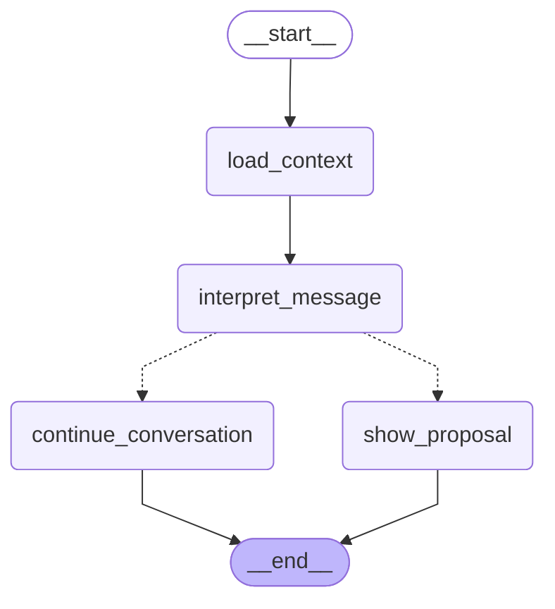

```mermaid
%%{init: {'flowchart': {'curve': 'linear'}}}%%
graph TD;
	__start__([<p>__start__</p>]):::first
	load_context(load_context)
	interpret_message(interpret_message)
	continue_conversation(continue_conversation)
	show_proposal(show_proposal)
	__end__([<p>__end__</p>]):::last
	__start__ --> load_context;
	continue_conversation --> __end__;
	load_context --> interpret_message;
	show_proposal --> __end__;
	interpret_message -.-> continue_conversation;
	interpret_message -.-> show_proposal;
	classDef default fill:#f2f0ff,line-height:1.2;
	classDef first fill-opacity:0;
	classDef last fill:#bfb6fc;
```
